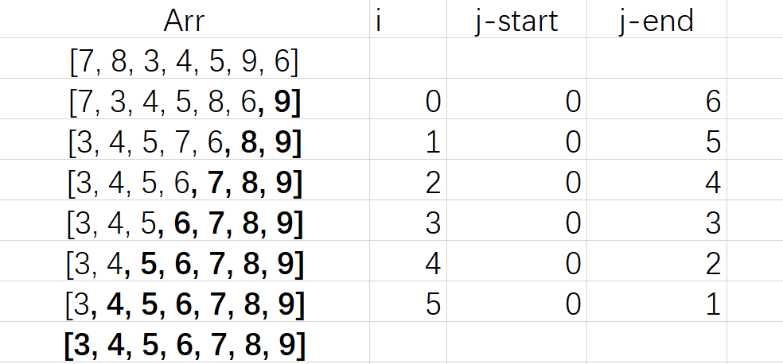

## 冒泡排序
> 动画网站:
[https://visualgo.net/en/sorting](https://visualgo.net/en/sorting)


#### 基础逻辑python实现

```python
arr = [7, 8, 3, 4, 5, 9, 6]
n = len(arr)
for i in range(n):
    for j in range(n-i-1):
        if arr[j] > arr[j+1]:
            temp = arr[j+1]
            arr[j+1] = arr[j]
            arr[j] = temp

print(arr)
```

#### 对应伪代码
```
FOR Counter ←  1 TO N
    FOR Index ← 1 TO N-Counter-1
        IF Arr[Index] > Arr[Index+1] THEN
            Temp ←  Arr[Index+1]
            Arr[Index+1] ← Arr[Index]
            Arr[Index] ← Temp
        ENDIF
    NEXT Index
NEXT Counter
```

#### 过程记录



#### 书本伪代码
```txt
First ← 1
Last ← 10
REPEAT
    Swap ← FALSE
    FOR Index ← First TO Last - 1
        IF Temperature[Index] > temperature[Index + 1]
          THEN
            Temp ← Temperature[Index]
            Temperature[Index] ← Temperature[Index + 1]
            Temperature[Index + 1] ← Temp
            Swap ← TRUE
        ENDIF
    NEXT Index
    Last ← Last - 1
UNTIL (NOT Swap) OR Last = 1
```

#### 书本python代码
`for`循环版本
```python
arr = [7, 8, 3, 4, 5, 9, 6]
n = len(arr)
for i in range(n):
    swap = False
    for j in range(n-i-1):
        if arr[j] > arr[j+1]:
            temp = arr[j+1]
            arr[j+1] = arr[j]
            arr[j] = temp
            swap = True

    if not swap:
        break
    
print(arr)
```

`while`循环版本
```python
arr = [7, 8, 3, 4, 5, 9, 6]

first = 0
last = len(arr)

swap = True
while last >= 1 and swap:
    swap = False
    for j in range(last-1):
        if arr[j] > arr[j+1]:
            temp = arr[j+1]
            arr[j+1] = arr[j]
            arr[j] = temp
            swap = True

    last = last - 1

print(arr)
```

#### 额外练习
验证一个数组是否排好序了
```python
def checkSorted(arr):
    # 如果排好序了（升序），则返回True
    # 否则返回False
    pass
```

测试代码

```python
arr1 = [1, 2, 3, 4, 5]
arr2 = [1, 2, 3, 5, 4]
arr3 = [2, 1, 3, 4, 5]

print(checkSorted(arr1))  # True
print(checkSorted(arr2))  # False
print(checkSorted(arr3))  # False
```

#### 对应真题
> 2023 s23 11