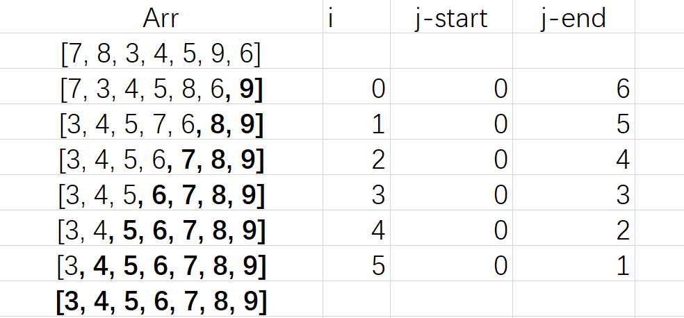

### 线性搜索
Linear search
#### search value

数组中查找数，输出其索引。不存在的索引特别标记为`-1`。
`demo101.py`:
```python
arr = [7, 8, 3, 4, 5, 9, 6]

value = int(input("Enter a value to search:"))
index = -1
for i in range(7):
    if arr[i] == value:
        index = i 

print("the index of value:", index)
```

#### search count
the search checks how many people chose `banana` as their favourite fruits,

`demo102.py`:
```python
fruits = [
    "apple", "banana", "cherry", "peach", "apple", "apple",
    "banana", "cherry", "banana", "peach", "banana"
]

kind = "banana"
Count = 0
for i in range(11):
    if fruits[i] == kind:
        Count = Count + 1

print(Count, "chose", kind)
```

伪代码 `demo102.txt`:
```txt
kind <- "banana"
count <- 0
FOR counter <- 1 TO 11
    IF fruits[counter] = kind 
      THEN
        count <- count + 1
    ENDIF
NEXT counter 
OUTPUT counter, "chose", kind
```

### 冒泡排序
> 动画网站:
[https://visualgo.net/en/sorting](https://visualgo.net/en/sorting)


#### 前置基础练习 - 升序检查
检查一个数组是否是升序的

`demo201.py`:
```python
arr = [3, 4, 5, 6, 7, 8, 9]

inOrder = True
for i in range(6):
    if arr[i] >= arr[i+1]:
        inOrder = False

if inOrder:
    print("arr is in order")
else:
    print("arr is not in order")
```

#### 基础冒泡逻辑
python实现
`demo202.py`:
```python
arr = [7, 8, 3, 4, 5, 9, 6]
n = len(arr)
for i in range(n):
    for j in range(n-i-1):
        if arr[j] > arr[j+1]:
            temp = arr[j+1]
            arr[j+1] = arr[j]
            arr[j] = temp

print(arr)
```

对应伪代码
`demo202.txt`:
```
FOR Counter ←  1 TO N
    FOR Index ← 1 TO N-Counter-1
        IF Arr[Index] > Arr[Index+1] THEN
            Temp ←  Arr[Index+1]
            Arr[Index+1] ← Arr[Index]
            Arr[Index] ← Temp
        ENDIF
    NEXT Index
NEXT Counter
```

**过程记录**



#### 教材案例逻辑
伪代码`demo203.txt`:

```txt
First ← 1
Last ← 10
REPEAT
    Swap ← FALSE
    FOR Index ← First TO Last - 1
        IF Temperature[Index] > temperature[Index + 1]
          THEN
            Temp ← Temperature[Index]
            Temperature[Index] ← Temperature[Index + 1]
            Temperature[Index + 1] ← Temp
            Swap ← TRUE
        ENDIF
    NEXT Index
    Last ← Last - 1
UNTIL (NOT Swap) OR Last = 1
```

python代码


`while`循环版本

`demo203.py`:
```python
arr = [7, 8, 3, 4, 5, 9, 6]

first = 0
last = len(arr)

swap = True
while last >= 1 and swap:
    swap = False
    for j in range(last-1):
        if arr[j] > arr[j+1]:
            temp = arr[j+1]
            arr[j+1] = arr[j]
            arr[j] = temp
            swap = True

    last = last - 1

print(arr)
```
